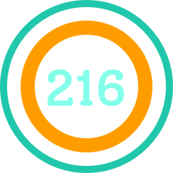

    

    
    
    
    

# Out Of 216

> another keyboard typing speedtest

=> [outof216.web.app](https://outof216.web.app)

## License

Under [MIT](https://github.com/blyndusk/node-typescript-starter/blob/master/LICENSE) license.
